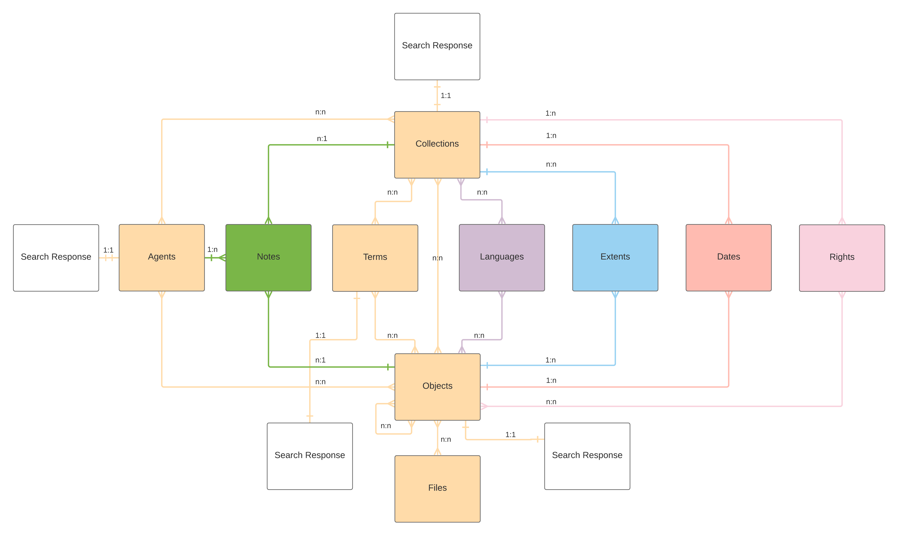

# rac_schemas

Rockefeller Archive Center JSON Schemas.

## Requirements
- Python 3.9 or higher
- [rac-schema-validator](https://pypi.org/project/rac-schema-validator/)
- [tox](https://tox.readthedocs.io/) (for running tests)
- [pre-commit](https://pre-commit.com/) (for running linters before committing)

## Installation

After installing pre-commit, install the git-hook scripts:

```
$ pre-commit install
```

## Usage

These schemas are intended for use with the validators from `rac-schema-validators`
but they are also valid JSONSchema files and can be used with other JSONSchema
validators.

### Available schemas

All schemas are located in the `schemas/` directory.

#### Tests

`rac_schemas` comes with unit tests as well as linting. The easiest way to make sure all tests pass is to run `tox` from the root of the repository. This will execute all tests, and will also run `autopep8` and `flake8` linters against the codebase.

## Documentation

Automatically generated HTML documentation in the `docs/` directory based upon `.json` files in the `schemas/` subdirectory of the `rac_schemas/` directory.

A simplified overview of the data model is below:



### Requirements

*   Python 3.9 or higher
*   [json-schema-for-humans](https://github.com/coveooss/json-schema-for-humans)

## Usage

Running `generate_docs.py` will iterate over the `schemas/` subdirectory and write updated docs files to the `docs/` directory.

## License

Code is released under an MIT license. See`LICENSE.md`.
